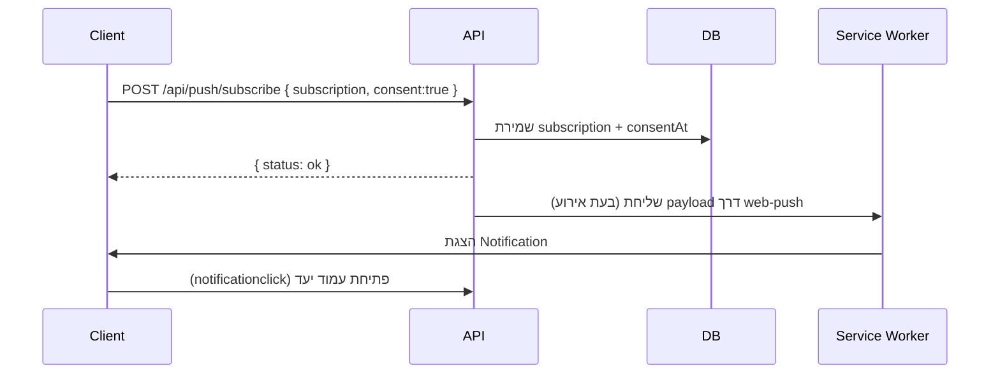

# VIPO Push Notifications Upgrade – Specification (Stage 1)

## 1. מטרות
- לאפשר שליחת התראות Push חינמיות (Web Push + VAPID) לכלל המשתמשים על כל מכשירי מובייל נתמכים.
- לספק מנגנון Opt-in/Opt-out ברור ללקוחות ולסוכנים לפני בקשת הרשאות הדפדפן.
- לאפשר למנהל המערכת לנהל תבניות הודעה ולהגדיר תזמונים (מיידי, עתידי, מחזורי) דרך ממשק ניהול ייעודי.
- להבטיח תאימות ל-PWA קיימת ולדפדפנים פופולריים באנדרואיד וב-iOS (16.4+).

## 2. היקף
- כולל: Backend, Service Worker, Frontend (לקוח/סוכן/מנהל), ממשק ניהול תבניות והתראות, מתזמן שליחות, תיעוד ו-QA.
- לא כולל: אפליקציה נייטיבית, שליחת הודעות SMS/Email (כבר קיימים בנפרד), אינטגרציה עם ספק צד-שלישי בתשלום.

## 3. רשימת התראות ופרמטרים דינמיים
| # | סוג הודעה | קהל יעד | שדות דינמיים |
|---|-----------|---------|----------------|
|1|הרשמה למערכת|לקוח/סוכן|שם משתמש (אופציונלי)|
|2|הצטרפות חדשה – מנהל|מנהל|סוג משתמש `{{user_type}}`, תאריך/שעה `{{datetime}}`|
|3|אישור רכישה|לקוח|מספר הזמנה (אופציונלי)|
|4|רכישה דרך קוד סוכן – לסוכן|סוכן|עמלה `{{commission_percent}}` (קבוע 10%)|
|5|רכישה דרך קוד סוכן – למנהל|מנהל|שם סוכן (אם קיים)|
|6|מכירה ששולמה|מנהל|מספר הזמנה|
|7|דוח יומי לסוכן|סוכן|כניסות `{{visits}}`, רכישות `{{orders}}`, עמלות `{{commission}}`|
|8|מוצר חדש נוסף|כל המשתמשים שהסכימו|שם מוצר (אופציונלי)|
|9|תזכורת שבועית לרכישה קבוצתית|לקוח שנרשם|זמן נותר `{{time_left}}`|
|10|תזכורת 24 שעות לפני סגירה|לקוח שנרשם|שם הקבוצה/מוצר|
|11|סגירת רכישה קבוצתית|משתתפים בסבב|שם הקבוצה/מוצר|

> ניתן להרחיב בממשק המנהל עם שדות נוספים בעתיד. כל התבניות נשמרות ומודעות לשדות הרלוונטיים.

## 4. זרימת Opt-in ו-Consent
1. המשתמש (לקוח/סוכן) נכנס לדשבורד או עמוד ראשי.
2. מוצג מודאל הסכמה מותאם תפקיד (שפה: עברית, RTL):
   - ללקוח: יתרונות (אישורים, תזכורות, מוצרים חדשים).
   - לסוכן: יתרונות (עמלות, דוחות, רכישות דרך קוד).
   - כולל קישור למדיניות פרטיות + ציון שניתן לכבות בכל עת.
3. לחיצה על "כן, שלחו לי עדכונים" → שמירת הסכמה ב-DB (סטטוס consent=true, תאריך) → בקשת `Notification.requestPermission()`.
4. אם ההרשאה התקבלה → רישום subscription ושליחה לשרת.
5. אם ההרשאה נדחתה או הוחזר "לא כעת" → נמשיך ללא התראות, נציג הודעה כיצד להפעיל בהמשך.
6. בעמוד הגדרות/פרופיל ניתן לנהל Opt-in/Opt-out ולצפות בסטטוס ההרשאה.

## 5. ארכיטקטורה
- **Frontend (Next.js 14) – דשבורד לקוחות/סוכנים/מנהל:**
  - מרכיב `NotificationConsentModal` עם טקסטים מותאמים.
  - Hook `usePushNotifications` לניהול בקשות הרשאה, רישום, ביטול.
  - עמוד מנהל `AdminNotifications` (עריכה + תזמון).

- **Service Worker (`/public/sw.js`):**
  - רישום תחת `/` (כבר קיים).
  - מאזין `push` שמרכיב notification מתוך נתוני payload.
  - מאזין `notificationclick` לפתיחת/פוקוס של חלון קיים והפניה ליעד.
  - טיפול ב-fallback אם חסר מידע (הודעה כללית עם קישור לדשבורד).

- **Backend (Next.js API routes / server):**
  - `POST /api/push/subscribe` – שמירת subscription + סטטוס consent.
  - `DELETE /api/push/subscribe` – הסרת subscription.
  - `GET/PUT /api/admin/notifications/:type` – עריכת תבניות.
  - `POST /api/admin/notifications/schedule` – קביעת שליחות עתידית.
  - שירות `sendPushNotification` משתמש בספריית `web-push` ומפתחות VAPID.
  - מתזמן (cron/queue) שמריץ שליחות מתוכננות ומחזוריות.

- **מסד נתונים (MongoDB):**
  - `pushSubscriptions` (userId, role, endpoint, keys, consentAt, revokedAt).
  - `notificationTemplates` (type, title, body, audience, dataSchema, enabled, updatedBy, updatedAt).
  - `scheduledNotifications` (templateId, payloadOverrides, audienceFilter, scheduleAt, recurrence, status, lastRunAt).
  - ניתן לאגור `notificationLogs` לצורך דוחות בעתיד (לא חובה בשלב זה).

## 6. תאימות פלטפורמות
- **Android (Chrome/Samsung/Firefox):** תמיכה מלאה ב-Web Push, כולל PWA).
- **iOS/iPadOS 16.4+ (Safari/WebKit):**
  - חייבים להנחות את המשתמש להוסיף למסך הבית (PWA) לפני בקשת הרשאות.
  - אם לא מותקן – מודאל יציג הסבר + כפתור "הוסף למסך הבית" (לבחינה אופציונלית).
  - נבדוק fallback (הודעה in-app) במקרה שאין תמיכה.
- **Desktop:** נתמך, אך ניתן לקבוע תנאי שיוצגו התראות רק למשתמשי מובייל אם זה רצוי (אפשרות להגדרה בממשק מנהל).

## 7. UI למנהל – דרישות
- מסך רשימת הודעות (11 ברירות מחדל): טבלה עם שם הודעה, קהל יעד, סטטוס (פעיל/לא פעיל), אפשרות עריכה.
- דף עריכת תבנית:
  - שדות: כותרת, טקסט, placeholders (עזרה בצדדים), בחירת audience (לקוחות/סוכנים/מנהלים/כולם), תיוג.
  - תצוגה מקדימה (preview) עם ערכים דוגמה.
- מודול תזמון:
  - בחירת תאריך/שעה (Timepicker), timezone (ברירת מחדל ישראל/UTC+2), recurrence (ללא/כל X ימים/שבועי).
  - בחירת טמפלט וקהל יעד נוסף (סינון לפי role / tag).
  - רשימת תזמונים פעילים עם אפשרות ביטול/עריכה.
- היסטוריית שליחות (אופציונלי, לשלב הבא): טבלה המציגה תאריך, כמות שנשלחה, הצלחות/כשלים.

## 8. API Design (High Level)


### Payload Example
```json
{
  "type": "purchase_confirmed",
  "title": "הרכישה שלך ב-vipogroup הושלמה",
  "body": "תודה רבה על הרכישה 🙏 התשלום התקבל בהצלחה.",
  "icon": "/icons/192.png",
  "url": "/dashboard/orders/123",
  "data": {
    "orderId": "123",
    "userType": "customer"
  }
}
```

## 9. תזמון ושליחות אוטומטיות
- שימוש ב-node-cron (או task runner קיים) להרצת הפונקציה `processDueNotifications` מתוך `@/lib/notifications/dispatcher` על פי `PUSH_SCHEDULER_CRON`.
- מודול `scheduler` שומר משימות ב-collection `scheduledNotifications` עם שדות: `templateType`, `audience`, `payloadOverrides`, `nextRunAt`, `recurrence`, `status`, `failureCount` ועוד.
- מודול `dispatcher` מרנדר תבנית (`notificationTemplates`) ל-payload, ממיר placeholders לערכים בפועל ושולח דרך `pushSender` לפי roles / tags / userIds.
- תקלות שליחה נרשמות לשדה `lastError` והמשימה נעצרת לסטטוס `paused` עד לטיפול מינהלי.
- משלוח מוצלח מעדכן `lastRunAt` ומחשב `nextRunAt` לפי recurrence. בהעדר recurrence המשימה נעצרת לסטטוס `completed`.
- Endpoint פנימי לטריגר קרון: `POST /api/internal/push/cron` (נתמך גם GET) עם כותרת `x-cron-secret`. ניתן להוסיף פרמטר `?dryRun=1` להפעלה ללא שליחה אמיתית.

## 10. הגדרות סביבה
- `PUSH_VAPID_PUBLIC_KEY`
- `PUSH_VAPID_PRIVATE_KEY`
- `PUSH_VAPID_SUBJECT` (למשל `mailto:support@vipogroup.com`)
- `PUSH_SCHEDULER_CRON` (לדוגמה `*/5 * * * *` לבדיקת משימות כל 5 דקות)
- `PUSH_DISPATCH_DRY_RUN` (אופציונלי, להפעלת לוגים ללא שליחה אמיתית בסביבת פיתוח/בדיקות)
- `PUSH_CRON_SECRET` (סיסמה לשירות הקרון הפנימי; חובה לפרודקשן)

## 11. בדיקות
- יחידה:
  - וידוא CRUD של `notificationTemplates` ו-`scheduledNotifications`.
  - בדיקת `sendTemplateNotification` עם mock ל-`pushSender` (תומך roles/tags/userIds/Broadcast).
  - בדיקת `processDueNotifications` עם משימות mock ובדיקה שהסטטוסים מתעדכנים.
- אינטגרציה: תרחישי שליחה מלאים (Opt-in → קביעת תזמון → קריאת cron → שליחת התראה בפועל).
- עומס: יצירת N משימות וידוא שהמתזמן מטפל בהן בסבב אחד ללא חריגות Rate Limit.
- ידניות: Android (Chrome/Samsung) + iOS 16.4+ (PWA). בדיקת Opt-in, שליחה מיידית/מתוזמנת, Opt-out, טיפול בכשל (הודעת שגיאה בממשק הניהול).

## 12. תיעוד והדרכה
- מדריך DevOps להגדרת ENV ופריסת המתזמן.
- מדריך מנהל: ניהול הודעות, עריכה, תזמון, ניהול הרשאות משתמשים.
- טבלת Troubleshooting: מה לעשות במקרה שההתראות לא מגיעות (בדיקת הרשאות דפדפן, מצב PWA).

## 13. שלבי פיתוח (תיאום עם התכנית הכללית)
1. **איפיון ותשתית** (מסמך זה, מפתחות VAPID, תרשים זרימה) – יום 1.
2. **Backend** (סכמות, API, מתזמן, שירות שליחה, בדיקות) – ימים 2-3.
3. **Frontend & Service Worker** (מודאל הסכמה, UI מנהל, hook ללקוחות/סוכנים, sw.js) – ימים 4-5.
4. **תיעוד, הדרכה ו-QA** (מסמכי הדרכה, בדיקות חוצות מכשירים) – יום 6.

---

מסמך זה משמש בסיס לביצוע שלב 1 בתכנית השדרוג. כל שינוי דרישות יתועד כאן לפני מעבר לשלבי הפיתוח הבאים.
